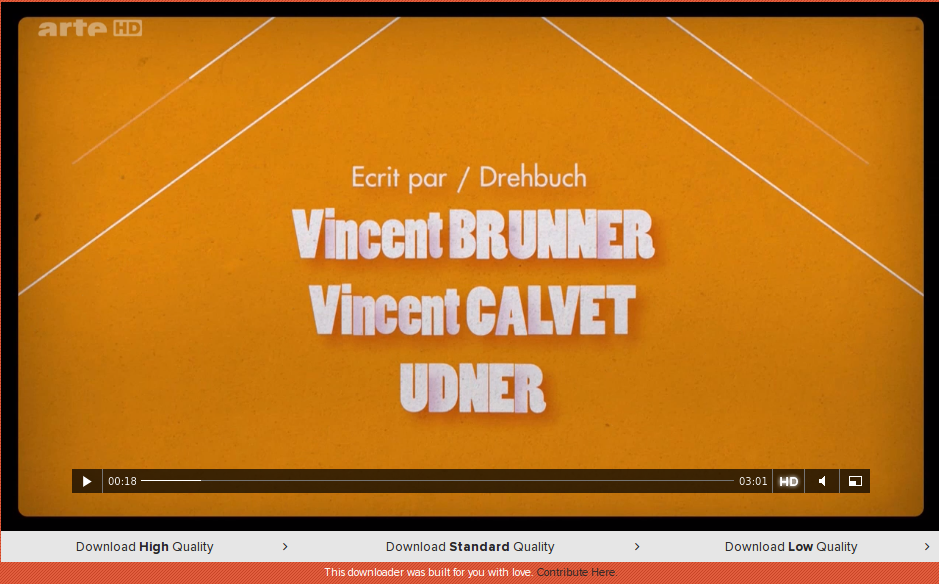

ARTE-Downloader
=================

Current version: **2.3.4**.

CONTRIBUTORS
-----------

Bumbadawg, GuGuss, aug-riedinger, maxlath, uahim

DESCRIPTION
-----------

This script works as a browser extension to download any video on [ARTE website](http://www.arte.tv/).

INSTALL - GOOGLE CHROME
-----------------------

* Download the [arte-downloader.user.js](../../raw/master/arte-downloader.user.js) file on your computer.

* Simply drag and drop the ``arte-downloader.user.js`` file on [__chrome://extensions__](chrome://extensions).

**Note**: Update by redoing those steps.

INSTALL - FIREFOX & OTHER
-------------------------

* Install the [Greasemonkey](https://addons.mozilla.org/en-US/firefox/addon/greasemonkey/) addon.

* Go to [arte-downloader.user.js](../../raw/master/arte-downloader.user.js): Greasemonkey should open a dialog window to allow the script installation. Click *Install* and you're all set!

USAGE
-----

Go to a video on [ARTE website](http://www.arte.tv/) and you should see buttons under a video:

* **Select** the language version.
* **Select** the quality.
* **Download** either the video, or its description.

In case of a livestream/direct, there are 2 options :
* Download the MP4 video
* Copy/paste the streaming link into [VLC](http://www.videolan.org/vlc/) and dump it to your drive with its convert tool (CTRL+R).

TEST PAGES
------- 
- Arte live: http://www.arte.tv/guide/fr/direct
- Arte +7: http://www.arte.tv/guide/fr/057458-000/albert-einstein-portrait-d-un-rebelle
- Arte info: http://info.arte.tv/fr/videos?id=71611
- Arte future: http://future.arte.tv/fr/ilesdufutur/les-iles-du-futur-la-serie-documentaire
- Arte creative: http://creative.arte.tv/fr/episode/bonjour-afghanistan
- Arte concert: http://concert.arte.tv/fr/documentaire-dans-le-ventre-de-lorgue-de-notre-dame

FAQ
---

**Why should I use this script ?**

If you often travel with poor Internet connections, now you can download videos to watch them later.

**Why ARTE ?**

ARTE channel is an amazing place for culture. If you don't have a TV : ARTE website is the only way to watch it.

DISCLAIMER
-------

This script is for personal use only. You alone have the responsability for any usage which could be against ARTE privacy policy.
